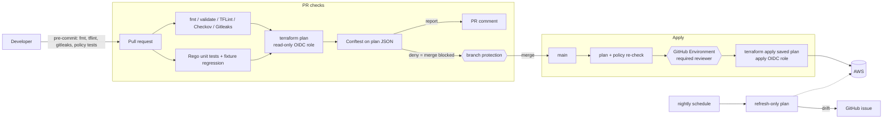

# IaC Policy Guardrails

Terraform on AWS where **no infrastructure change reaches the cloud unless it passes automated security policy**, every decision leaves an audit trail, and the pipeline holds **no long-lived credentials**.

Built as a DevSecOps course project: shift-left IaC security with policy-as-code (OPA/Rego + Conftest), static analysis (Checkov, TFLint), keyless CI (GitHub OIDC), gated applies and drift detection.

## How it works



| Layer | Tool | Catches |
|---|---|---|
| Local | pre-commit | Formatting, lint, secrets, broken policies, before a commit exists |
| Static | Checkov, TFLint, `terraform validate` | Hundreds of generic misconfigurations and provider errors in `.tf` source |
| Plan | Conftest + custom Rego | Organization-specific rules evaluated against the **resolved plan**, so variables, modules and defaults are already expanded |
| Merge | Branch protection + CODEOWNERS | Policy or pipeline changes without review |
| Apply | GitHub Environment + OIDC role split | Unreviewed applies; CI credentials that outlive the job |
| Runtime | Nightly drift detection | Console changes that bypass the pipeline |

## Repository layout

```
bootstrap/                 One-time setup: state bucket, GitHub OIDC, plan/apply roles
infra/
  modules/                 network, storage, compute, database
  envs/dev/                Root module for the dev environment
policies/
  terraform/               Rego policies (package main) + config.rego settings
  tests/                   Rego unit tests (57)
  data/exceptions.json     Approved, time-boxed policy exceptions
  fixtures/                Sample plans for offline demos and regression tests
.github/
  workflows/               pr-checks.yml, apply.yml, drift.yml
  actions/setup-tools/     Pinned, checksum-verified Terraform + Conftest
  scripts/                 PR comment renderer
docs/                      threat-model.md, exceptions.md, demo.md
```

## Policy catalog

| ID | Level | Rule |
|---|---|---|
| NET-001 | deny | SSH/RDP/WinRM open to `0.0.0.0/0` or `::/0` (all three security group rule styles) |
| NET-002 | warn | Any other internet ingress except 80/443 |
| NET-003 | warn | Subnet auto-assigns public IPs |
| S3-001 | deny | Bucket without a public access block setting all four flags |
| S3-002 | deny | Bucket without explicit server-side encryption |
| S3-003 | warn | Bucket without versioning |
| S3-004 | deny | Public canned ACL |
| DB-001 | deny | RDS publicly accessible |
| DB-002 | deny | RDS storage not encrypted |
| DB-003 | deny | RDS instance class not on the allow-list |
| DB-004 | warn | Deletion protection disabled |
| DB-005 | warn | Backup retention under 7 days |
| IAM-001 | deny | `Action: "*"` or service-wide `"s3:*"` in an Allow statement |
| IAM-002 | warn | `Resource: "*"` in an Allow statement |
| IAM-003 | deny | Attaching AdministratorAccess, IAMFullAccess or PowerUserAccess |
| IAM-004 | deny | Long-lived IAM user access keys |
| IAM-005 | deny | Role trust policy open to any AWS principal |
| CMP-001 | deny | EC2 instance type not on the allow-list |
| CMP-002 | deny | IMDSv1 allowed |
| CMP-003 | deny | Unencrypted root volume |
| CMP-004 | warn | Instance gets a public IP |
| TAG-001 | deny | Missing `owner`, `environment` or `data-classification` tag |
| TAG-002 | deny | `data-classification` outside the approved values |
| GOV-001 | deny | Region not on the allow-list |
| GOV-002 | deny | Plan deletes or replaces a database, bucket, DynamoDB table or KMS key |
| EXC-001 | warn | A policy exception has expired |
| EXC-002 | deny | A policy exception is missing required fields |

Allow-lists and thresholds live in [`policies/terraform/config.rego`](policies/terraform/config.rego). Exceptions are explained in [`docs/exceptions.md`](docs/exceptions.md).

## Try the policies without AWS

Install [Conftest](https://www.conftest.dev/install/), then:

```bash
make policy-test   # 57 Rego unit tests
make policy-demo   # secure sample plan passes, insecure one fails with 13 denials
```

## Setup

You need an AWS account, a GitHub repository, and locally: Terraform ≥ 1.10, Conftest, TFLint, Checkov and pre-commit (`make help` lists every target).

### Step 1 – Bootstrap (once, with your own admin credentials)

```bash
cd bootstrap
cp terraform.tfvars.example terraform.tfvars   # set owner and github_repository
terraform init
terraform apply
terraform output
```

The bootstrap state is local at first. To move it into the bucket it just created, add a `backend "s3"` block to `bootstrap/versions.tf` (key `bootstrap/terraform.tfstate`, `use_lockfile = true`) and run `terraform init -migrate-state`. Bootstrap is applied by hand on purpose: the pipeline must not be able to modify its own permissions.

### Step 2 – Configure GitHub

**Settings → Secrets and variables → Actions → Variables** (these are identifiers, not secrets):

| Variable | Value |
|---|---|
| `AWS_REGION` | `terraform output -raw aws_region` |
| `TF_STATE_BUCKET` | `terraform output -raw state_bucket` |
| `AWS_PLAN_ROLE_ARN` | `terraform output -raw plan_role_arn` |
| `AWS_APPLY_ROLE_ARN` | `terraform output -raw apply_role_arn` |

**Settings → Environments → New environment `dev`** → add yourself (or your reviewer) under *Required reviewers*, and limit deployment branches to `main`.

**Settings → Branches → Add rule for `main`:** require a pull request, require status checks *Format, lint, scan*, *Policy unit tests* and *Plan and policy check*, require Code Owner review, and do not allow bypassing.

Update `.github/CODEOWNERS` with your username.

### Step 3 – First run

```bash
cd infra/envs/dev
cp backend.hcl.example backend.hcl    # your bucket and region
# set owner in terraform.tfvars
terraform init -backend-config=backend.hcl
terraform providers lock -platform=linux_amd64 -platform=darwin_arm64 -platform=darwin_amd64 -platform=windows_amd64
```

Commit `.terraform.lock.hcl`, push a branch, open a PR, and watch the checks run. Merge it, approve the `dev` deployment, and the stack deploys.

### Step 4 – Install local hooks

```bash
pip install pre-commit && pre-commit install
```

## Cost

Everything targets the free tier: t3.micro EC2, db.t4g.micro RDS (20 GB), no NAT gateway, AWS managed KMS keys. Expect a few dollars a month at most (Secrets Manager secret, EC2 detailed monitoring, CloudWatch logs). Set `enable_database = false` while iterating, and destroy when you are not demoing:

```bash
cd infra/envs/dev && terraform destroy
```

## Demo

[`docs/demo.md`](docs/demo.md) is a five-minute scripted demo: a pull request that opens SSH to the internet is blocked, fixed, merged, approved and applied, then a console change is caught by drift detection.

## Stretch goals

- Replace `PowerUserAccess` on the apply role with a hand-written policy and a permissions boundary on every role the pipeline creates
- Add a `prod` environment with stricter `config.rego` values and two required reviewers
- Pin every action to a commit SHA (Dependabot keeps them current)
- Upload Checkov results as SARIF to GitHub code scanning
- Infracost on pull requests, with a policy that warns above a monthly budget
- Sign the saved plan and verify it before apply
